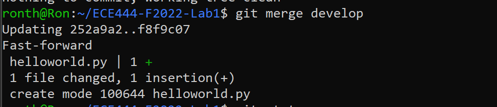

Ron Thomas

**Activity 1**\

**Activity 2**\

**Actvity 3**\

**Activity 4**\
Teammate github link: [https://github.com/richzhan](https://github.com/richzhan/ECE444-F2022-Lab1)
Making changes to teammate repo:

Teammate making changes to my repo:

**Activity 5**\

**Activity 6**\
https://github.com/ronjoethomas/ECE444-F2022-EP

**Activity 7**\

**Activity 8**\

